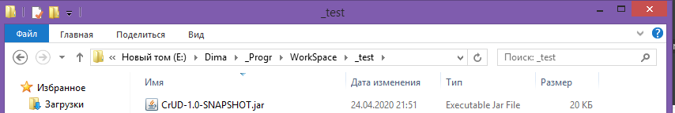
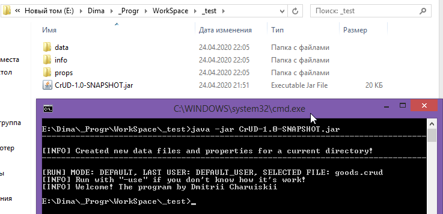
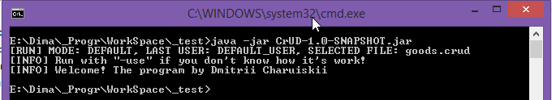
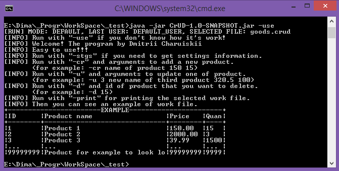

# CrUD
`The CrUD is a simple program for Create-Update-Delete goods.
The CrUD create a data into tha table with four columns.`

Columns of work file:
---------------------
+ _ID number - from 1 to 99999999 (8 character column);_
+ _Product name (30 character column);_
+ _Price - from 0.01 to 99999999  (8 character column);_
+ _Quantity - from 0 to 9999      (4 character column)._

``You can work with a default file, create new data files and delete data files.``

`Let's use the generated JAR file:`

`First run:`

After first run we'll get a [INFO] message that files and properties created, which mode is active, ect.

`Usual run:`

`How to use:`

`Looks how you can work with data files:`

####Let's try this...